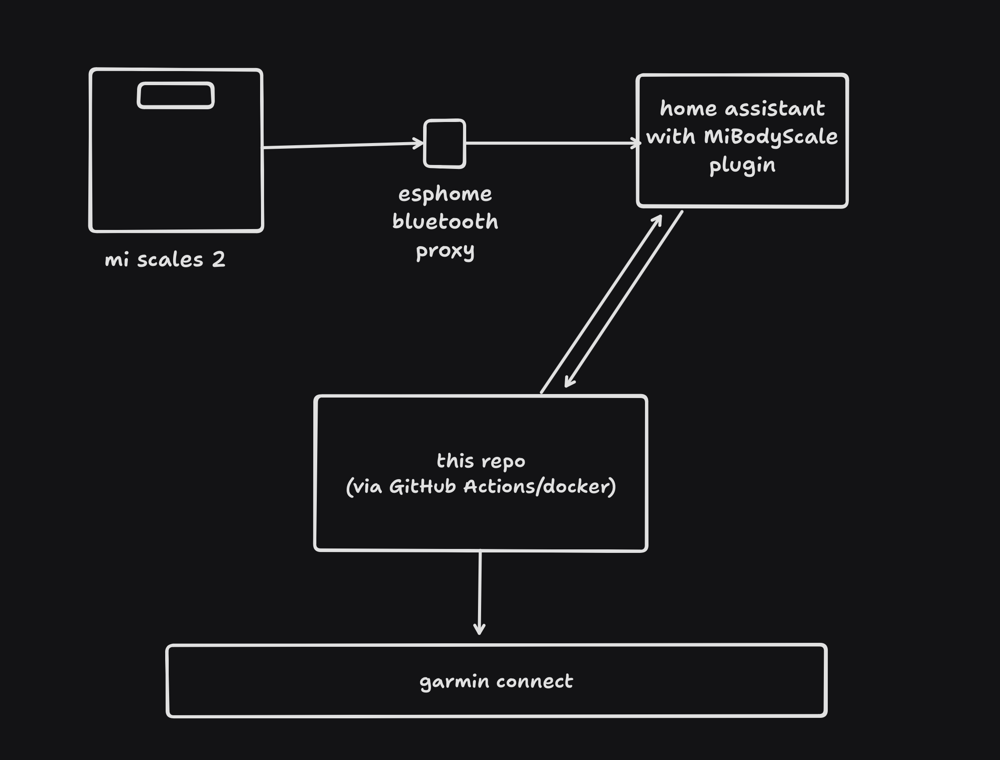

# Mi Scales 2 -> Garmin connect sync
# WIP

inspired by [HAWeightSensor2GarminConnect](https://github.com/Myrenic/HAWeightSensor2GarminConnect)

repo helps me sync my weight on xiaomi mi scales 2 (composition scales) to the garmin connect using home assistant.

once you put it in the schedule - it's `set and forget`.
general flow how the sync works:

two main ways to run this:

1. use your own docker. (run .sh file)
fill the .env and run sync.sh:
chmod +x sync.sh && sync.sh``

2. setup a github action. (i run it once every day, which is think is more than enough)

